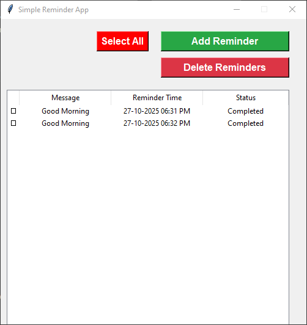

<div align="center">

# 🕒 Simple Reminder App  

### ⏰ A Python + Tkinter reminder app with background notification service  

[](https://www.python.org/)
[](https://opensource.org/licenses/MIT)
[](https://github.com/)
[](https://github.com/)

A lightweight desktop reminder app built using **Python**, **Tkinter**, and **Pandas**.  
Easily add, view, and delete reminders — with automatic **desktop notifications** handled by a background service.  

</div>

---


## 🖼️ App Preview

Here’s what the app looks like in action:



---

## 📁 Project Structure

```
Reminder/
│
├── main.py          # Main GUI application
├── service.py       # Background reminder service
├── reminders.csv    # Data file (auto-created)
└── preview.png      # App screenshot (for README preview)
```

---

## 🚀 Features

✅ Add new reminders with **date, time, and message**  
✅ Delete selected reminders  
✅ Select all reminders with one click  
✅ Auto-refresh reminder list every 10 seconds  
✅ Background notification service (runs automatically)  
✅ Desktop notifications via **plyer**  
✅ Data stored in **CSV** (persistent between sessions)  

---

## 🧰 Requirements

Make sure you have **Python 3.8+** installed.

Install dependencies using pip:

```bash
pip install tkcalendar pandas plyer
```

> 📝 Note: `tkinter` usually comes pre-installed with Python on Windows.  
> If not, install it via your system’s package manager.

---

## ⚙️ How It Works

- The **`main.py`** file launches the graphical interface.  
- You can:
  - Add reminders with a date, time, and message.
  - View all reminders in a table.
  - Delete selected reminders.
- When you start the main app, it automatically starts the **`service.py`** script in the background.  
- The **`service.py`** file checks every **30 seconds** for reminders whose time has passed and shows a desktop notification.

---

## 🧭 Usage Guide

### 1️⃣ Run the App
Run the GUI app:
```bash
python main.py
```

When you open it:
- You’ll see a table with all saved reminders.
- Use **“Add Reminder”** to add a new one.
- The **“Delete Reminders”** button removes selected entries.

---

### 2️⃣ Add a Reminder
- Choose a **date** using the calendar picker.
- Set the **time (hours, minutes, AM/PM)**.
- Enter a **message**.
- Click **Add Reminder**.

Your reminder will be saved in `reminders.csv`.

---

### 3️⃣ Notification Service
You don’t need to run anything separately —  
`main.py` automatically launches `service.py` silently in the background.

`service.py`:
- Runs every 30 seconds.
- Checks if any reminders are due.
- Displays a system notification.
- Updates the reminder status from `Pending` → `Completed`.

---

### 4️⃣ Data Storage
All reminders are stored in a CSV file:
```
reminders.csv
```

Columns:
| Message | Reminder Time | Status |
|----------|----------------|--------|
| Good Morning | 2025-10-28 07:00:00 | Pending |

---

## 🪄 Converting to EXE (Optional)

You can convert your app to an `.exe` file using **PyInstaller**:

```bash
pip install pyinstaller
```

Then build:

```bash
pyinstaller --noconsole --onefile --add-data "reminders.csv;." --add-data "service.py;." main.py
```

Your EXE will be inside the `dist` folder.

> ⚠️ Make sure `service.py` and `reminders.csv` are in the same directory as `main.py` before building.

---

## 🧩 Troubleshooting

**❌ SyntaxError: invalid syntax (line with `service_process is_`)**
- Ensure the line in `main.py` reads:
  ```python
  if service_process is None:
  ```
  (not `is_`)

**❌ Notification not appearing**
- Check that `plyer` is installed properly.
- Some systems may require enabling notification permissions.

**❌ CSV not found**
- The file `reminders.csv` will be auto-created the first time you run the app.

---

## 💡 Future Improvements
- Add sound/vocal notifications  
- Support recurring reminders  
- System tray icon with background running option  
- Dark mode UI  
